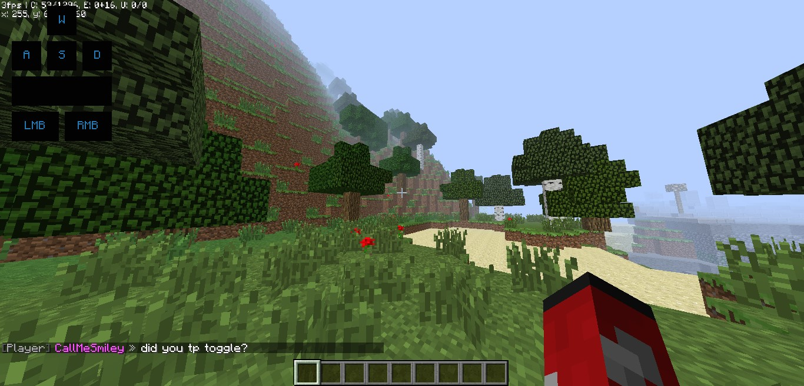

# Eagler Craft

Discover a world of creativity, challenges, and endless fun with EaglerCraft. Experience the magic of Minecraft, transformed into a browser-based adventure that you can enjoy anytime, anywhere. Get ready to embark on an unforgettable journey within the virtual realms of EaglerCraft."

- [Installation](#installation)
- [Usage](#usage)
- [Credits](#credits)

# Installation
Download and extract the Eaglercraft software, and subsequently proceed to upload it to your designated website upon completion. For Live Demo, please visit the following URL: https://rtrade.github.io/minecraft.

# Usage

# Credits
https://github.com/lax1dude - Eaglercraft.
 
https://github.com/poodeveloper - Eaglercraft Modifications.
 
https://github.com/rtrade - Compatibility with multiple Eaglercraft versions, such as 1.3 , 1.5.2 & 1.8.8.
 
Please note that Eaglercraft is a project managed by lax1dude and not affiliated with Mojang or Microsoft. It's essential to respect the original creators and support the official version of Minecraft if you have the means to do so.
